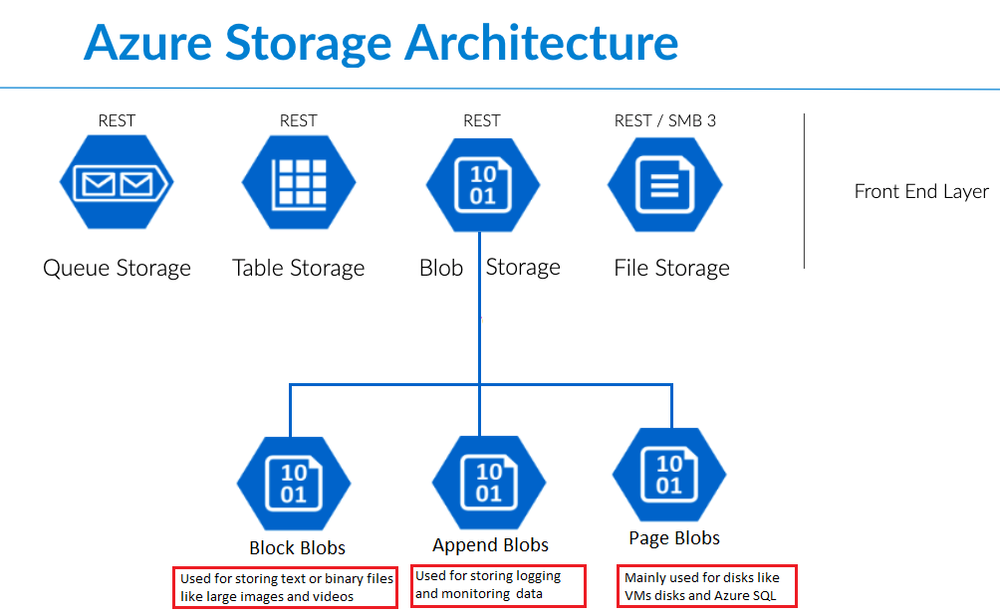

#  Azure Blob Storage




## Introduction to Azure Blob storage
Azure Blob storage is Microsoft's object storage solution for the cloud. Blob storage is optimized for storing massive amounts of unstructured data. Unstructured data is data that doesn't adhere to a particular data model or definition, such as text or binary data.

## About Blob storage
 - Blob storage is designed for:
   - Serving images or documents directly to a browser.
   - Storing files for distributed access.
   - Streaming video and audio.
   - Writing to log files.
   - Storing data for backup and restore, disaster recovery, and archiving.
   - Storing data for analysis by an on-premises or Azure-hosted service.

Users or client applications can access objects in Blob storage via HTTP/HTTPS, from anywhere in the world. Objects in Blob storage are accessible via the Azure Storage REST API, Azure PowerShell, Azure CLI, or an Azure Storage client library. Client libraries are available for different languages, including:

1. ```.NET```
2. ```Java```
3. ```Node.js```
4. ```Python```
5. ```Go```
6. ``PHP``
7. ``Ruby``


## Quickstart: Azure Blob Storage client library v12 for .NET
The examples in this quickstart show you how to use the Azure Blob Storage client library v12 for .NET to:

- [Get the connection string](#get-the-connection-string)
- [Create a container](#create-a-container)
- [Upload a blob to a container](#upload-a-blob-to-a-container)
- [List blobs in a container](#list-blobs-in-a-container)
- [Download a blob](#download-a-blob)
- [Delete a container](#delete-a-container)
## Get the connection string
The code below retrieves the connection string for the storage account from the environment variable created in the Configure your storage connection string section.

Add this code inside the Main method:
```c#
Console.WriteLine("Azure Blob Storage v12 - .NET quickstart sample\n");

// Retrieve the connection string for use with the application. The storage
// connection string is stored in an environment variable on the machine
// running the application called AZURE_STORAGE_CONNECTION_STRING. If the
// environment variable is created after the application is launched in a
// console or with Visual Studio, the shell or application needs to be closed
// and reloaded to take the environment variable into account.
string connectionString = Environment.GetEnvironmentVariable("AZURE_STORAGE_CONNECTION_STRING");
```

## Create a container

Decide on a name for the new container. The code below appends a GUID value to the container name to ensure that it is unique.
Create an instance of the BlobServiceClient class. Then, call the CreateBlobContainerAsync method to create the container in your storage account.

Add this code to the end of the Main method:
```c#
// Create a BlobServiceClient object which will be used to create a container client
BlobServiceClient blobServiceClient = new BlobServiceClient(connectionString);

//Create a unique name for the container
string containerName = "quickstartblobs" + Guid.NewGuid().ToString();

// Create the container and return a container client object
BlobContainerClient containerClient = await blobServiceClient.CreateBlobContainerAsync(containerName);
```
## Upload a blob to a container
The following code snippet:

1. Creates a text file in the local data directory.
2. Gets a reference to a BlobClient object by calling the GetBlobClient method on the container from the Create a container section.
3. Uploads the local text file to the blob by calling the UploadAsync method. This method creates the blob if it doesn't already exist, and overwrites it if it does.

Add this code to the end of the Main method:
```c#
// Create a local file in the ./data/ directory for uploading and downloading
string localPath = "./data/";
string fileName = "quickstart" + Guid.NewGuid().ToString() + ".txt";
string localFilePath = Path.Combine(localPath, fileName);

// Write text to the file
await File.WriteAllTextAsync(localFilePath, "Hello, World!");

// Get a reference to a blob
BlobClient blobClient = containerClient.GetBlobClient(fileName);

Console.WriteLine("Uploading to Blob storage as blob:\n\t {0}\n", blobClient.Uri);

// Upload data from the local file
await blobClient.UploadAsync(localFilePath, true);
```

## List blobs in a container
List the blobs in the container by calling the GetBlobsAsync method. In this case, only one blob has been added to the container, so the listing operation returns just that one blob.

Add this code to the end of the Main method:
```C#
Console.WriteLine("Listing blobs...");

// List all blobs in the container
await foreach (BlobItem blobItem in containerClient.GetBlobsAsync())
{
    Console.WriteLine("\t" + blobItem.Name);
}
```
## Download a blob
Download the previously created blob by calling the DownloadToAsync method. The example code adds a suffix of "DOWNLOADED" to the file name so that you can see both files in local file system.

Add this code to the end of the Main method:
```C#
// Download the blob to a local file
// Append the string "DOWNLOADED" before the .txt extension 
// so you can compare the files in the data directory
string downloadFilePath = localFilePath.Replace(".txt", "DOWNLOADED.txt");

Console.WriteLine("\nDownloading blob to\n\t{0}\n", downloadFilePath);

// Download the blob's contents and save it to a file
await blobClient.DownloadToAsync(downloadFilePath);
```
## Delete a container
The following code cleans up the resources the app created by deleting the entire container by using DeleteAsync. It also deletes the local files created by the app.

The app pauses for user input by calling Console.ReadLine before it deletes the blob, container, and local files. This is a good chance to verify that the resources were actually created correctly, before they are deleted.

Add this code to the end of the Main method:
```C#
// Clean up
Console.Write("Press any key to begin clean up");
Console.ReadLine();

Console.WriteLine("Deleting blob container...");
await containerClient.DeleteAsync();

Console.WriteLine("Deleting the local source and downloaded files...");
File.Delete(localFilePath);
File.Delete(downloadFilePath);

Console.WriteLine("Done");
```