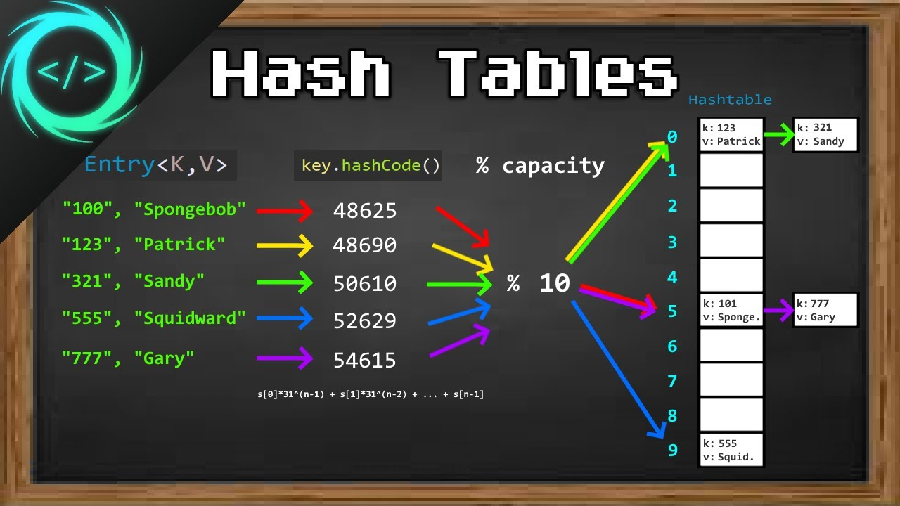

# Data Structure and Algorithms - Hash-Table
Hash Table is a data structure which stores data in an associative manner. In a hash table, data is stored in an array format, where each data value has its own unique index value. Access of data becomes very fast if we know the index of the desired data.

Thus, it becomes a data structure in which insertion and search operations are very fast irrespective of the size of the data. Hash Table uses an array as a storage medium and uses hash technique to generate an index where an element is to be inserted or is to be located from.

## Hashing
Hashing is a technique to convert a range of key values into a range of indexes of an array. We're going to use modulo operator to get a range of key values. Consider an example of hash table of size 20, and the following items are to be stored. Item are in the (key,value) format.

