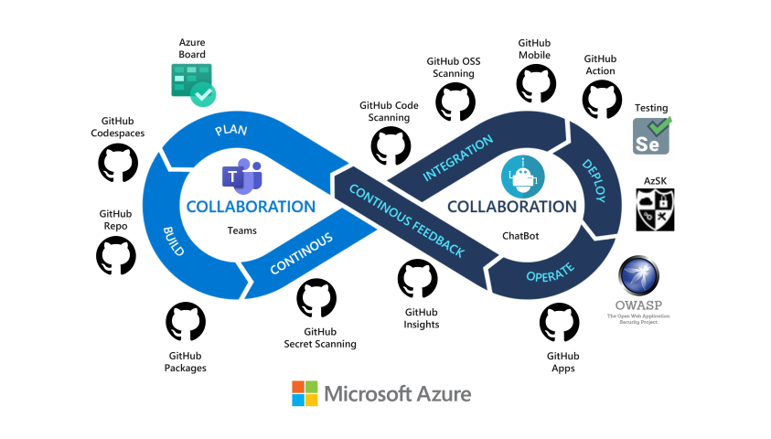

# Intro to MVC

==============================

## Azure Dev Ops

Azure DevOps provides developer services for allowing teams to plan work, collaborate on code development, and build and deploy applications. Azure DevOps supports a collaborative culture and set of processes that bring together developers, project managers, and contributors to develop software. It allows organizations to create and improve products at a faster pace than they can with traditional software development approaches.
### You can use one or more of the following standalone services based on your business needs:
 - Azure Repos provides Git repositories or Team Foundation Version Control (TFVC) for source control of your code.
 - Azure Pipelines provides build and release services to support continuous integration and delivery of your applications. 
 - Azure Boards delivers a suite of Agile tools to support planning and tracking work, code defects, and issues using Kanban and Scrum methods. 
 - Azure Test Plans provides several tools to test your apps, including manual/exploratory testing and continuous testing.
 - Azure Artifacts allows teams to share packages such as Maven, npm, NuGet, and more from public and private sources and integrate package sharing into your pipelines.

### You can also use the following collaboration tools:

 - Customizable team dashboards with configurable widgets to 
 - share information, progress, and trends
 - Built-in wikis for sharing information
 - Configurable notifications

### What features and services do I get with Azure DevOps?
 # Azure DevOps Services 

 # Dashboards
