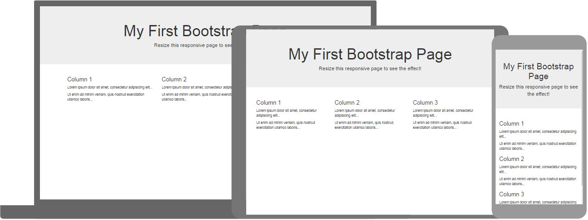

# Bootstrap 
This Bootstrap tutorial contains hundreds of Bootstrap examples.

With our online editor, you can edit the code, and click on a button to view the result.

## What is Bootstrap?
 - Bootstrap is a free front-end framework for faster and easier web development
 - Bootstrap includes HTML and CSS based design templates for typography, forms, buttons, tables, navigation, modals, image carousels and many other, as well as optional JavaScript plugins
 - Bootstrap also gives you the ability to easily create responsive designs

 ## Bootstrap History
Bootstrap was developed by Mark Otto and Jacob Thornton at Twitter, and released as an open source product in August 2011 on GitHub.

In June 2014 Bootstrap was the No.1 project on GitHub!

## Where to Get Bootstrap?

There are two ways to start using Bootstrap on your own web site.

You can:

  - Download Bootstrap from getbootstrap.com
  - Include Bootstrap from a CDN