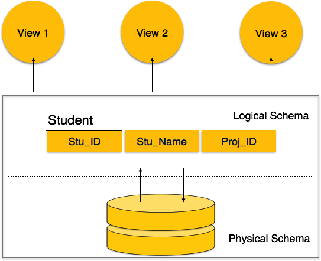

## Database Management System (DBMS):
What Does Database Management System (DBMS) Mean?
A database management system (DBMS) is a software package designed to define, manipulate, retrieve and manage data in a database. A DBMS generally manipulates the data itself, the data format, field names, record structure and file structure. It also defines rules to validate and manipulate this data.

- Real-world entity 

- Relation-based tables − DBMS allows entities and relations among them to form tables. A user can understand the architecture of a database just by looking at the table names.

- Isolation of data and application − A database system is entirely different than its data.

- Less redundancy

- Consistency − Consistency is a state where every relation in a database remains consistent. 

- Query Language 

- ACID Properties − DBMS follows the concepts of Atomicity, Consistency, Isolation, and Durability (normally shortened as ACID).  

- Multiuser and Concurrent Access − DBMS supports multi-user environment and allows them to access and manipulate data in parallel.

- Multiple views − DBMS offers multiple views for different users.uirements.

- Security − Features like multiple views offer security to some extent where users are unable to access data of other users and departments. 

==============================================================================================================

## Database Schema
A database schema is the skeleton structure that represents the logical view of the entire database. It defines how the data is organized and how the relations among them are associated. It formulates all the constraints that are to be applied on the data.

============================================================================================

## Types of Database Keys

1. Primary Key
A primary key is a column of a table or a set of columns that helps to identify every record present in that table uniquely. There can be only one primary Key in a table. Also, the primary Key cannot have the same values repeating for any row. Every value of the primary key has to be different with no repetitions.

2. Foreign Key
Foreign Key is used to establish relationships between two tables. A foreign key will require each value in a column or set of columns to match the Primary Key of the referential table. Foreign keys help to maintain data and referential integrity. 

3. Composite Key
Composite Key is a set of two or more attributes that help identify each tuple in a table uniquely. The attributes in the set may not be unique when considered separately. However, when taken all together, they will ensure uniqueness.

==============================================================================================================================

## Database Relationships
- One-To-Many Relationship
A one-to-many (1:N) relationship means a record in Table A can relate to zero, one, or many records in Table B. Many records in Table B can relate to one record in Table A. The potential relationship is what's important; for a single record in Table A, there might be no related records in Table B, or there might be only one related record, but there could be many. Look at the following tables about a company's Customers and Orders.

- One-To-One Relationship
A one-to-one (1:1) relationship means that each record in Table A relates to one, and only one, record in Table B, and each record in Table B relates to one, and only one, record in Table A. Look at the following example of tables from a company's Employees database:
 
- Many-To-Many Relationship
Examine the sample data below. These tables hold data about employees and the projects to which they are assigned. Each project can involve more than one employee and each employee can be working on more than one project (the "do more with less" thing). This constitutes a many-to-many (N:N) relationship.

 

git add