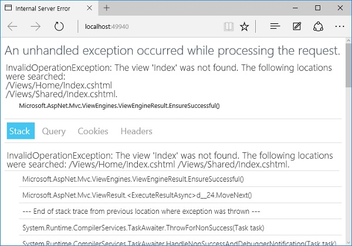
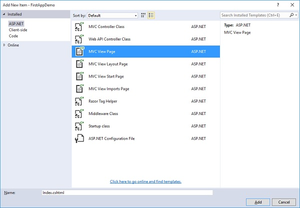
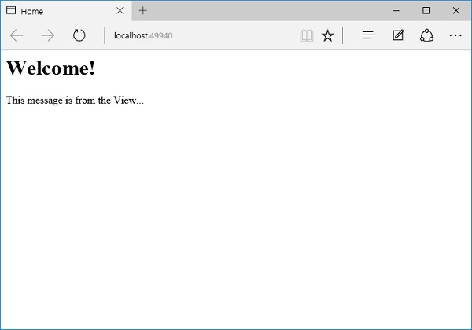

# MVC Forms

## Views in ASP.NET Core MVC
In an ASP.NET Core MVC application, there is nothing like a page and it also doesn’t include anything that directly corresponds to a page when you specify a path in the URL. The closest thing to a page in an ASP.NET Core MVC application is known as a view.

- As you know that in ASP.NET MVC application, all incoming browser requests are handled by the controller and these requests are mapped to the controller actions.

- A controller action might return a view or it might also perform some other type of action such as redirecting to another controller action.

- With the MVC framework, the most popular method for creating HTML is to use the Razor view engine of ASP.NET MVC.

- To use this view engine, a controller action produces a ViewResult object, and a ViewResult can carry the name of the Razor view that we want to use.


- The view will be a file on the file system and the ViewResult can also carry along a model object to the view and the view can use this model object when it creates the HTML.

- When the MVC framework sees that your controller action produces a ViewResult, the framework will find the view on the file system, execute the view, which produces HTML, and it is this HTML which the framework sends back to the client.

### Example
Let us now take a simple example to understand how this works in our application by changing the HomeController Index method implementation as shown in the following program.

```c#
using FirstAppDemo.Models; 
using Microsoft.AspNet.Mvc; 

using System; 
using System.Collections.Generic; 
using System.Linq; 
using System.Threading.Tasks;  

namespace FirstAppdemo.Controllers { 
   public class HomeController : Controller { 
      public ViewResult Index() { 
         var employee = new Employee { ID = 1, Name = "Mark Upston"}; 
         return View(); 
      } 
   } 

```
Inside HomeController, instead of producing an ObjectResult, let us just return what the View() method returns. The View method doesn't return an ObjectResult. It creates a new ViewResult, so we will also change the return type of the Index method to ViewResult. The View method does accept some parameters here. We will invoke this method without any other parameter. Let us save your file and refresh your browser.




This is because the MVC framework has to go out and find that view but there is no view right now.

- Views by default in a C# ASP.NET project are files that have a *.cshtml extension and the views follow a specific convention. By default, all views live in a Views folder in the project.

- The view location and the view file name will be derived by ASP.NET MVC if you don't give it any additional information.

- If we need to render a view from the Index action of the HomeController, the first place that the MVC framework will look for that view is inside the Views folder.

- It will go into a Home folder and then look for a file called Index.cshtml − the file name starts with Index because we are in the Index action.

- The MVC framework will also look in a Shared folder and views that you place inside the Shared folder, you can use them anywhere in the application.



In the left pane, select the MVC View Page and enter index.cshtml in the name field and click on the Add button.

Let us add the following code in the index.cshtml file.

```Html
<html xmlns = "http://www.w3.org/1999/xhtml"> 
   <head> 
      <title>Home</title> 
   </head>

   <body> 
      <h1>Welcome!</h1> 
      
      <div> 
         This message is from the View...  
      </div> 
   </body> 

</html> 
```



=================================================================================================================
# 4 Ways To Create Form In ASP.NET MVC
1. FORMS – WEAKLY TYPED
This is the easiest and quickest way to create forms in MVC.

1. Go to Views  Home  Index.cshtml and update it with following code.

```html
<h4 style="color:purple">
    <b>ID:</b>    @ViewBag.ID <br />
    <b>Name:</b>  @ViewBag.Name <br />
    <b>Addon:</b> @ViewBag.Addon
</h4>
<hr />
<h3><b>Forms: Weakly Typed</b></h3>
 
<form action="form1" method="post">
    <table>
        <tr>
            <td>Enter ID: </td>
            <td><input type="text" name="txtId" /></td>
        </tr>
        <tr>
            <td>Enter Name: </td>
            <td><input type="text" name="txtName" /></td>
        </tr>
        <tr>
            <td>Addon: </td>
            <td><input type="checkbox" name="chkAddon" /></td>
        </tr>
        <tr>
            <td colspan="2"><input type="submit" value="Submit Form" /></td>
        </tr>
    </table>
</form>
```
2. Now, add an action method for this form in HomeController.cs

```c#
[HttpPost] 
        public ActionResult form1(int txtId, string txtName, string chkAddon)
        {
            ViewBag.Id = txtId;
            ViewBag.Name = txtName;
            if (chkAddon != null)
                ViewBag.Addon = "Selected";
            else
                ViewBag.Addon = "Not Selected";
 
            return View("Index");
        }
```


## Advantage:
1. It is easy to create a form using Weakly Typed mechanism
2. Mostly used when you need to create a form with one or two input items.

## Disadvantage:
1. Because, it is not strongly typed so IntelliSense doesn't help you.
2. Have higher chance of getting exception and runtime error messages.
3. Very difficult to manage when forms have multiple input items and controls.
4. It is very clumsy when you need to add or remove some input items.


## gSUMMARY
In this tutorial, you learned 4 different ways to create form and submit data to the controller. All these 4 ways used widely in MVC and I hope now you will be able to create a form in ASP.NET MVC. In the next chapter, you will learn FormCollection object in details with programming example. FormCollection objects make a job much easier when collecting form data into the controller.
