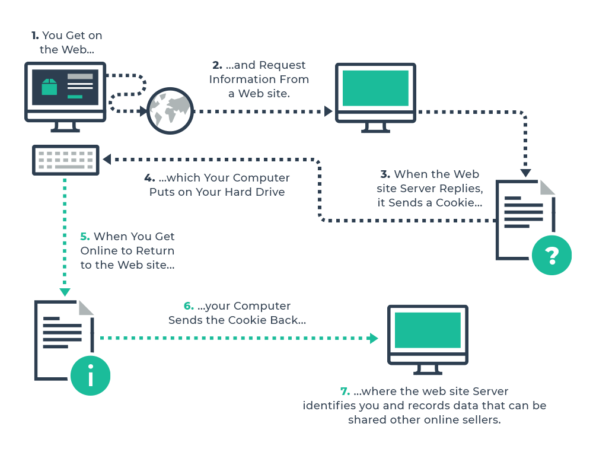

# Read: 28 - MVC / Cookies

=======================================================
## Using HTTP cookies
An HTTP cookie (web cookie, browser cookie) is a small piece of data that a server sends to a user's web browser. The browser may store the cookie and send it back to the same server with later requests. Typically, an HTTP cookie is used to tell if two requests come from the same browser—keeping a user logged in, for example. It remembers stateful information for the stateless HTTP protocol.

Cookies are mainly used for three purposes:

- Session management
Logins, shopping carts, game scores, or anything else the server should remember

- Personalization
User preferences, themes, and other settings

- Tracking
Recording and analyzing user behavior

```
Cookies were once used for general client-side storage
```


=======================================================

## HTTP cookies explained

HTTP cookies, most often just called “cookies,” have been around for a while but are still not very well understood. The first problem is a lot of misconceptions, ranging from cookies as spyware or viruses to just plain ignorance over how they work. The second problem is a lack of consistent interfaces to work with cookies. Despite all of the issues surrounding them, cookies are such an important part of web development that, should they disappear without a replacement, many of our favorite web applications would be rendered useless.

### What is a cookie?
Quite simply, a cookie is a small text file that is stored by a browser on the user’s machine. Cookies are plain text; they contain no executable code. A web page or server instructs a browser to store this information and then send it back with each subsequent request based on a set of rules. 

### Cooke creation
A web server specifies a cookie to be stored by sending an HTTP header called Set-Cookie. The format of the Set-Cookie header is a string as follows (parts in square brackets are optional):
```cooke
Set-Cookie: <em>value</em>[; expires=<em>date</em>][; domain=<em>domain</em>][; path=<em>path</em>][; secure]

```

Automatic cookie removal
There are a few reasons why a cookie might be automatically removed by the browser:

Session cookies are removed when the session is over (browser is closed).
Persistent cookies are removed when the expiration date and time have been reached.
If the browser’s cookie limit is reached, then cookies will be removed to make room for the most recently created cookie. For more details, see my post on cookie restrictions.
Cookie management is important to avoid any of these automatic removal cases when they are unintended.

## Conclusion
There’s a lot to know and understand about cookies in order to use them effectively. It’s truly amazing how a technique created more than ten years ago is still in use in almost the exact same way as it was first implemented. This post is a guide to the basics that everyone should know about cookies in browsers but is not, in any way, a complete reference. Cookies are an important part of the web today and improperly managing them can lead to all kinds of issues from poor user experience to security holes. I hope that this writeup has shed some light on the magic of cookies.


===============================================================
## .NET Cookies Simplified
### Cookies
What is a cookie?
A cookie is basically a physical, plain-text file stored by the client (usually a browser), tied to a specific website. The client will then allow this specific website to read the information stored in this file on subsequent requests, basically allowing the server (or even the client itself) to store information for later use.
### Setting and reading cookies
1. Setting a cookie, and reading it again later on, with ASP.NET MVC is very, very easy. 
```C#
HttpContext.Response.Cookies.Append("user_id", "1");

```
2. Notice how I use the Response property on the HttpContext class, where I can access the Cookies property.
```c#
var userId = HttpContext.Request.Cookies["user_id"];

```
3. how I now use the Request property instead of the Response, when reading the value back - the reason is that setting a cookie is done by adding information to the response sent to the client, while reading it means that you are pulling information from the request made by the client (a normal browser will automatically send all relevant cookies with each request).
```C#
public class CookiesController : Controller
{
    public IActionResult Index()
    {
    if(!HttpContext.Request.Cookies.ContainsKey("first_request"))
    {
        HttpContext.Response.Cookies.Append("first_request", DateTime.Now.ToString());
        return Content("Welcome, new visitor!");
    }
    else
    {
        DateTime firstRequest = DateTime.Parse(HttpContext.Request.Cookies["first_request"]);
        return Content("Welcome back, user! You first visited us on: " + firstRequest.ToString());
    }
    }
}
```

```
More properties of CookieOptions
There are several other interesting properties to be found on CookieOptions, like IsEssential, HttpOnly and Secure. If you want to know more about them, I suggest that you have a look at the documentation for CookieOptions.
```
### Summary
Thanks to cookies, you can save information about the visitor and retrieve it again on subsequent requests. This is a very important technique, used in a wide range of situations, like keeping the user logged in, tracking their use of your website and much more.