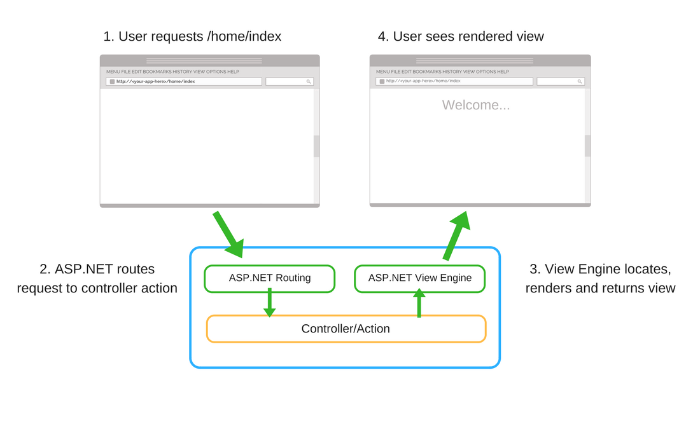
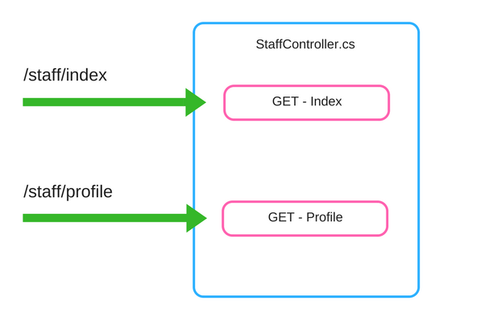

# Razor-Pages

## Introduction to Razor Pages in ASP.NET Core

## intro to  Razor Pages
Razor Pages is a newer, simplified web application programming model. It removes much of the ceremony of ASP.NET MVC by adopting a file-based routing approach. Each Razor Pages file found under the Pages directory equates to an endpoint. Razor Pages have an associated C# objected called the page model, which holds each page's behavior. Additionally, each page works on the limited semantics of HTML, only supporting GET and POST methods.

In this video, we'll create a complete request/response experience using a single Razor Pages endpoint. We can start with the ASP.NET Razor Pages template installed with .NET.

We first start by creating a storage mechanism to hold our Name value. We are using TempData, which is a volatile storage mechanism provided by ASP.NET. Any data stored in TempData will only exist from the time of our incoming request to the time we return a response.

Our next step is to implement our OnPost method, which will process our incoming form data, and assign it to our TempData property. After storage, we want to redirect the page to the OnGet handler of our page. Redirecting is an essential part of web development, as it avoids the additional POST requests when we refresh a URL in our browser session.

From here, we can edit the HTML in our Razor Page. We create a form that posts to our OnPost handler, along with an input for Name. The HTML syntax should look very familiar to seasoned web developers.

Running our application, we can see our functionality in action. We can view our HTML, POST the form with our name, and display the Name property, which we stored in TempData.


### Code Snippets
All snippets are included in their final form. They exclude namespaces, as those may differ depending on the project name.

Index.cshtml
The following view is located under /Pages/Index.cshtml.

```html
@page
@model IndexModel
@{
    ViewData["Title"] = "Home page";
}

<div class="text-center">
    <h1 class="display-4">Welcome @Model.Name</h1>
</div>

<form method="post" asp-page="Index">
  <div class="form-group">
    <label asp-for="Name"></label>
    <input asp-for="Name" class="form-control" placeholder="Enter Name" autocomplete="off" />    
  </div>
    <button type="submit" class="btn btn-primary">Submit</button>
</form>s
```
```C#
public class IndexModel : PageModel
{
    public string Name => (string)TempData[nameof(Name)];
    
    public void OnGet()
    {
    }
    
    public IActionResult OnPost([FromForm]string name)
    {
        TempData["Name"] = name;
        return RedirectToPage("Index");
    }
}


```


## Razor Pages with ASP.NET Core 2
## Why Razor Pages?
MVC developers want probably ask why we need one more way to build web sites on ASP.NET Core? Isn’t MVC enough? From information I have found from public space I found the following reasoning:

1. It’s easier to get to web development for beginners as Razor pages are more lightweight than MVC. Besides beginners there are people who are coming from other scripting languages be it old ASP or PHP or something else.

2.  Razor Pages fit well to smaller scenarios where building controllers and models as separate classes is overkill.

### Creating Razor Pages application
This is the first tutorial of a series that teaches the basics of building an ASP.NET Core Razor Pages web app.

For a more advanced introduction aimed at developers who are familiar with controllers and views, see Introduction to Razor Pages. For a video introduction, see Entity Framework Core for Beginners.

If you're new to ASP.NET Core development and are unsure of which ASP.NET Core web UI solution will best fit your needs, see Choose an ASP.NET Core UI.

At the end of the series, you'll have an app that manages a database of movies.

In this tutorial, you:

Create a Razor Pages web app.
Run the app.
Examine the project files.
At the end of this tutorial, you'll have a working Razor Pages web app that you'll enhance in later tutorials.


## MVC vs Razor Pages - A quick comparison
I’m trying to learn ASP.NET but am really confused. All the tutorials seem to conflict with each other over whether I should be using MVC or Razor Pages?

If you’re learning ASP.NET in this brave new .NET Core world and you want to build server-side web applications then it’s a straight fight between two contenders.

Just to be clear, by sticking to “server-side” we’re deliberately ignoring another option; building Web APIs in order to serve front-end frameworks like Angular.

In the blue corner we have MVC and in the red, the new kid on the block, Razor Pages.

In truth they share a lot of the same underlying framework but there are some key differences.

Before you decide which one to adopt for your next project, it’s worth taking a moment to directly compare them.

# MVC
The old stager, been around since v1 all the way back in 2009.

Here’s a rough overview of how MVC requests are handled by ASP.NET Core.


The routing engine is key to how ASP.NET Core decides to handle your requests.

It can be configured to route any request to any controller action.

The default routing configuration uses a combination of the controller and action names.

/<controller name>/<action name>

So a request to /staff/index would route to the action called Index on the StaffController.



## In conclusion
So there you have it.

A quick comparison of MVC and Razor Pages.

It’s early days for Razor Pages, they will almost certainly improve over the next few releases and it’s not clear whether there is any kind of widescale adoption of in the industry.

What is certain is that MVC is here to stay. With so many existing apps written using it and the significant improvements which came with ASP.NET Core MVC, MVC isn’t likely to disappear anytime soon.
