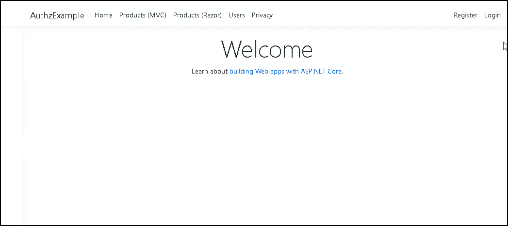
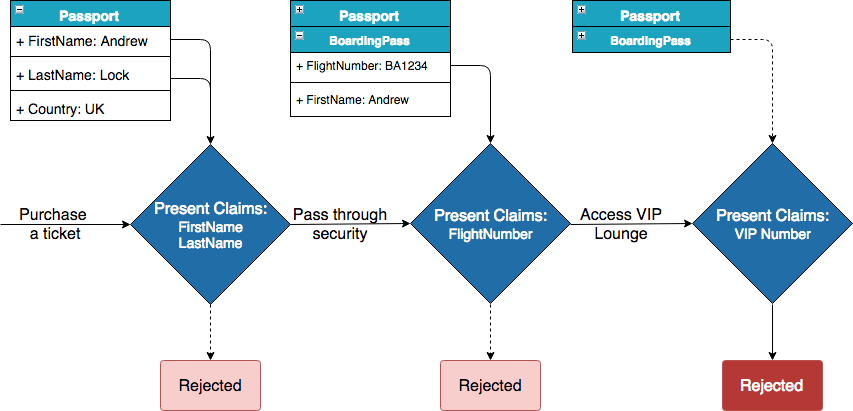
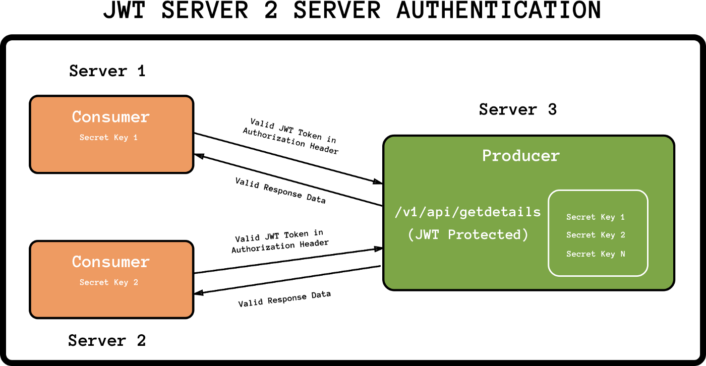

# Roles, Claims and JWT Tokens Submission Requirements


## Claims-based authorization in ASP.NET Core
A claim is a name value pair that represents what the subject is, not what the subject can do. For example, you may have a driver's license, issued by a local driving license authority. Your driver's license has your date of birth on it. In this case the claim name would be DateOfBirth, the claim value would be your date of birth, for example 8th June 1970 and the issuer would be the driving license authority. 

### Adding claims checks
 - Claim based authorization checks:
    - Are declarative.
    - Are applied to Razor Pages, controllers, or actions within a controller.
    - Can not be applied at the Razor Page handler level, they must be applied to the Page.


Claims in code specify claims which the current user must possess, and optionally the value the claim must hold to access the requested resource. Claims requirements are policy based, the developer must build and register a policy expressing the claims requirements.




## Introduction to Authentication with ASP.NET Core

### The difference between Authentication and Authorisation

First of all, we should clarify the difference between these two dependent facets of security. The simple answer is that Authentication is the process of determining who you are, while Authorisation revolves around what you are allowed to do, i.e. permissions. Obviously before you can determine what a user is allowed to do, you need to know who they are, so when authorisation is required, you must also first authenticate the user in some way.
1. Authentication in ASP.NET Core
The fundamental properties associated with identity have not really changed in ASP.NET Core - although they are different, they should be familiar to ASP.NET developers in general.
2. Claims-based authentication
The concept of claims-based authentication can be a little confusing when you first come to it, but in practice it is probably very similar to approaches you are already using.
```c#
public class ClaimsIdentity: IIdentity
{
    public string AuthenticationType { get; }
    public bool IsAuthenticated { get; }
    public IEnumerable<Claim> Claims { get; }

    public Claim FindFirst(string type) { /*...*/ }
    public Claim HasClaim(string type, string value) { /*...*/ }
}
```
3. Multiple Identities
Hopefully at this point you have a conceptual handle on claims and how they relate to an Identity. I said at the beginning of this section that the User property on HttpContext is a ClaimsPrincipal, not a ClaimsIdentity, so lets take a look at a simplified version of it:

```c#
public class ClaimsPrincipal :IPrincipal
{
    public IIdentity Identity { get; }
    public IEnumerable<ClaimsIdentity> Identities { get; }
    public IEnumerable<Claim> Claims { get; }

    public bool IsInRole(string role) { /*...*/ }
    public Claim FindFirst(string type) { /*...*/ }
    public Claim HasClaim(string type, string value) { /*...*/ }
}
```



```Summary
In this post, I described how claims-based authentication works and how it applies to ASP.NET Core. In the next post, I will look at the next stage of the authentication process - how the cookie middleware actually goes about signing you in with the provided principal. Subsequent posts will cover how you can use multiple authentication handlers, how authorisation works, and how ASP.NET Core Identity ties it all together.
```


## JWT to authenticate Servers API’s

What is JWT? 
JSON Web Token (JWT) is a means of representing claims to be transferred between two parties. The claims in a JWT are encoded as a JSON object that is digitally signed using JSON Web Signature (JWS) and/or encrypted using JSON Web Encryption (JWE).

This is the second part of the series of two shorts post regarding the practical application of JWT.
1. JWT for downloading the files at the client.
2. JWT for the server to server authentication (current blog post).


