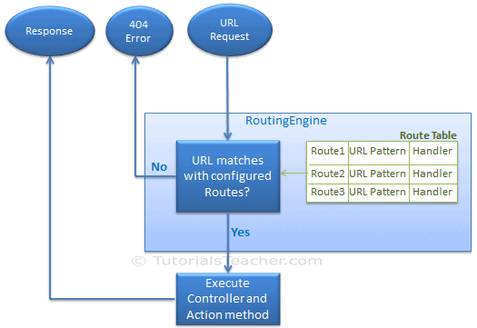
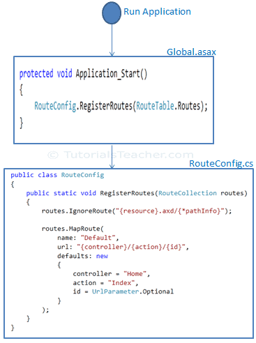

# Routing in MVC
ASP.NET introduced Routing to eliminate the needs of mapping each URL with a physical file. Routing enables us to define a URL pattern that maps to the request handler. 
## Route
Route defines the URL pattern and handler information. All the configured routes of an application stored in RouteTable and will be used by the Routing engine to determine appropriate handler class or file for an incoming request.

The following figure illustrates the Routing process.

## Summary
The goal of this tutorial was to provide you with a brief introduction to ASP.NET Routing. We examined the default route table that you get with a new ASP.NET MVC application. You learned how the default route maps URLs to controller actions.

========================================================================================

# Routing in ASP.NET Core
Routing is responsible for matching incoming HTTP requests and dispatching those requests to the app's executable endpoints. Endpoints are the app's units of executable request-handling code. Endpoints are defined in the app and configured when the app starts. The endpoint matching process can extract values from the request's URL and provide those values for request processing. Using endpoint information from the app, routing is also able to generate URLs that map to endpoints.

Apps can configure routing using:

- Controllers
- Razor Pages
- SignalR
- gRPC Services
- Endpoint-enabled middleware such as Health Checks.
- Delegates and lambdas registered with routing.

This article covers low-level details of ASP.NET Core routing. For information on configuring routing:

- For controllers, see Routing to controller actions in ASP.NET Core.
- For Razor Pages conventions, see Razor Pages route and app conventions in ASP.NET Core.

# Routing basics

The preceding example includes a single endpoint using the MapGet method:

When an HTTP GET request is sent to the root URL /:
The request delegate executes.
Hello World! is written to the HTTP response.
If the request method is not GET or the root URL is not /, no route matches and an HTTP 404 is returned.
Routing uses a pair of middleware, registered by UseRouting and UseEndpoints:

UseRouting adds route matching to the middleware pipeline. This middleware looks at the set of endpoints defined in the app, and selects the best match based on the request.
UseEndpoints adds endpoint execution to the middleware pipeline. It runs the delegate associated with the selected endpoint.
 

 1. Endpoints  
  2. Endpoint metadata
3. Routing concepts
