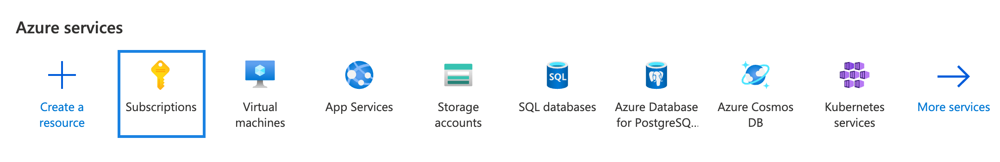
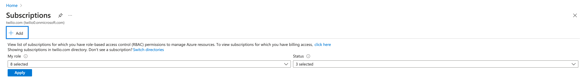
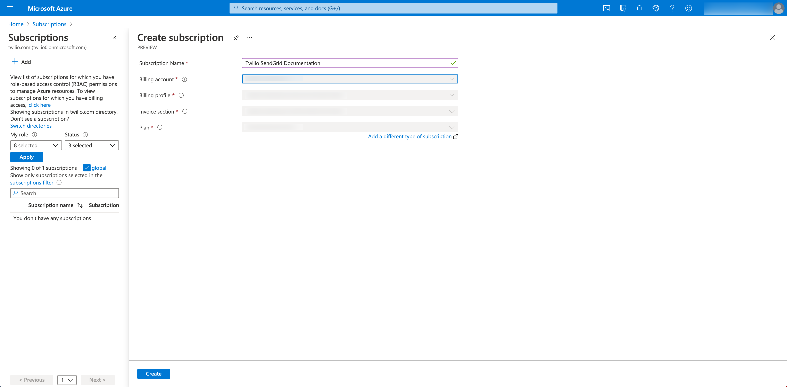
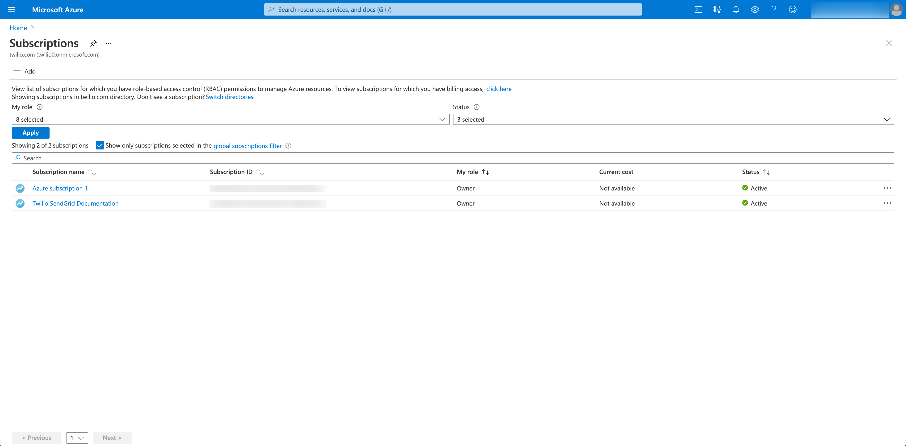
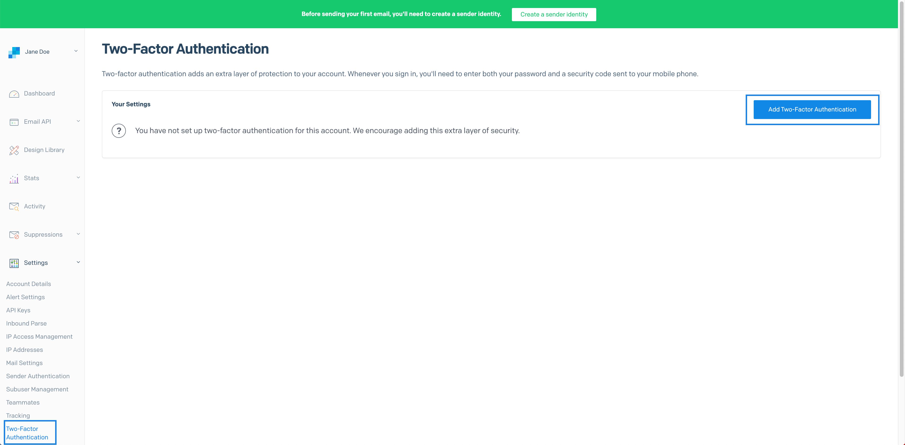
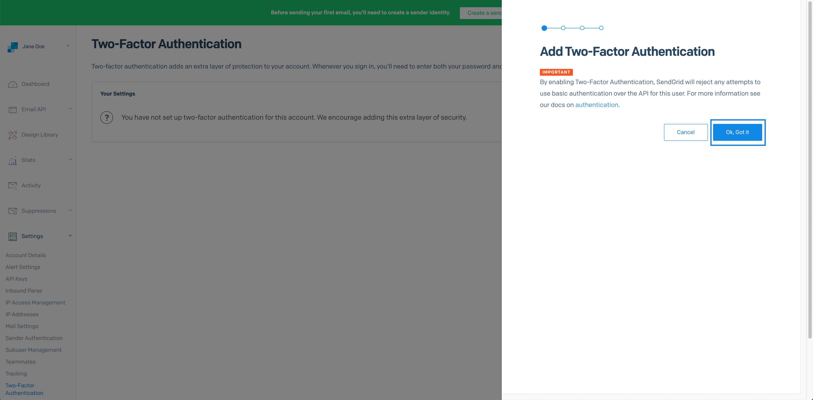

# SendGrid

## Sending Email with Microsoft Azure
This guide will help you create and configure a Twilio SendGrid account using Microsoft Azure. Once your account is ready, you'll be on your way to delivering email at scale.

## Create an Azure Subscription

To get started with Twilio SendGrid and Azure, visit the Azure Portal home page. You will need to sign in or create a Microsoft account if you do not already have one.

## Twilio SendGrid account setup
Before sending your first email, you will need to complete the following Twilio SendGrid account setup. These requirements help secure your account and keep your messages from landing in spam folders.

- Configure Two-factor authentication
- Create an API key
- Complete Sender Authentication

==================================================================================

### Two-factor authentication
Twilio SendGrid uses Two-factor authentication (2FA) to help protect your account. To enable 2FA, Navigate to Two-Factor Authentication in the Twilio SendGrid Settings menu, and click Add Two-Factor Authentication.

========================================================================================
## API keys
API Keys authenticate your application, mail client, or website with Twilio SendGrid services. Unlike a username and password, API keys are scoped to provide access only to the services you select. You can also delete and create API keys without impacting your other account credentials. For these reasons, Twilio SendGrid requires you to connect to its services using API keys.

## Reactivate your Twilio SendGrid account
If you have unsubscribed from Twilio SendGrid and need the service again in the future, you will need to create a new subscription. If your account has been suspended, you can reactivate the service by paying any outstanding account balance. Once payment has been received, you'll be able to reactivate your account.