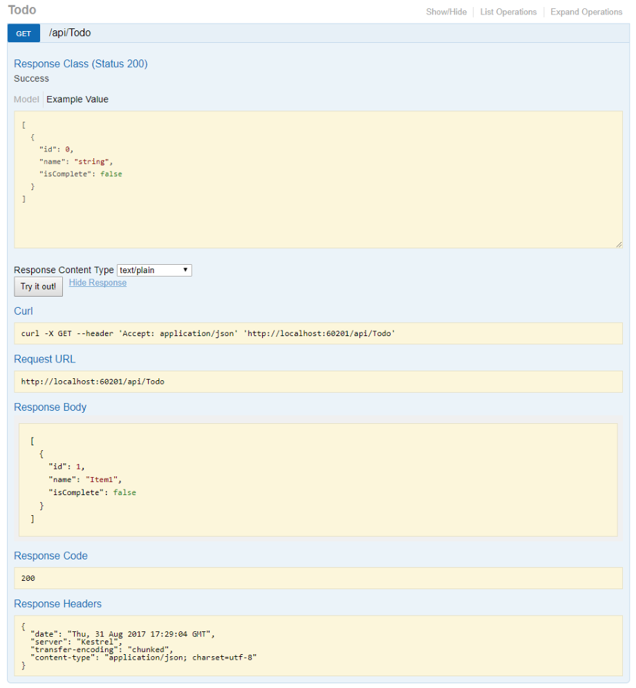

# Things I want to know more about


# ASP.NET Core web API documentation with Swagger / OpenAPI

Swagger (OpenAPI) is a language-agnostic specification for describing REST APIs. It allows both computers and humans to understand the capabilities of a REST API without direct access to the source code. Its main goals are to:

- Minimize the amount of work needed to connect decoupled services.
- Reduce the amount of time needed to accurately document a service.


## OpenApi vs. Swagger
The Swagger project was donated to the OpenAPI Initiative in 2015 and has since been referred to as OpenAPI. Both names are used interchangeably. However, "OpenAPI" refers to the specification. "Swagger" refers to the family of open-source and commercial products from SmartBear that work with the OpenAPI Specification. Subsequent open-source products, such as OpenAPIGenerator, also fall under the Swagger family name, despite not being released by SmartBear.

In short:

1. OpenAPI is a specification.
2. Swagger is tooling that uses the OpenAPI specification. For example, OpenAPIGenerator and SwaggerUI.


## OpenAPI specification (openapi.json)

The OpenAPI specification is a document that describes the capabilities of your API. The document is based on the XML and attribute annotations within the controllers and models. 

`````
{
  "openapi": "3.0.1",
  "info": {
    "title": "API V1",
    "version": "v1"
  },
  "paths": {
    "/api/Todo": {
      "get": {
        "tags": [
          "Todo"
        ],
        "operationId": "ApiTodoGet",
        "responses": {
          "200": {
            "description": "Success",
            "content": {
              "text/plain": {
                "schema": {
                  "type": "array",
                  "items": {
                    "$ref": "#/components/schemas/ToDoItem"
                  }
                }
              },
              "application/json": {
                "schema": {
                  "type": "array",
                  "items": {
                    "$ref": "#/components/schemas/ToDoItem"
                  }
                }
              },
              "text/json": {
                "schema": {
                  "type": "array",
                  "items": {
                    "$ref": "#/components/schemas/ToDoItem"
                  }
                }
              }
            }
          }
        }
      },
      "post": {
        …
      }
    },
    "/api/Todo/{id}": {
      "get": {
        …
      },
      "put": {
        …
      },
      "delete": {
        …
      }
    }
  },
  "components": {
    "schemas": {
      "ToDoItem": {
        "type": "object",
        "properties": {
          "id": {
            "type": "integer",
            "format": "int32"
          },
          "name": {
            "type": "string",
            "nullable": true
          },
          "isCompleted": {
            "type": "boolean"
          }
        },
        "additionalProperties": false
      }
    }
  }
}
`````


## Swagger UI





==================================================
# Creating Unit Tests for ASP.NET MVC Applications (C#)

##  Creating the Controller under Test
Let's start by creating the controller that we intend to test. The controller, named the ProductController, is contained in Listing 1.

-  Listing 1 – ProductController.cs

``` C#
using System;
using System.Web.Mvc;

namespace Store.Controllers
{
     public class ProductController : Controller
     {
          public ActionResult Index()
          {
               // Add action logic here
               throw new NotImplementedException();
          }

          public ActionResult Details(int Id)
          {

               return View("Details");
          }
     }
}
```

The ProductController contains two action methods named Index() and Details(). Both action methods return a view. Notice that the Details() action accepts a parameter named Id.


## Testing the View returned by a Controller
Imagine that we want to test whether or not the ProductController returns the right view. We want to make sure that when the ProductController.Details() action is invoked, the Details view is returned. The test class in Listing 2 contains a unit test for testing the view returned by the ProductController.Details() action.

- Listing 2 – ProductControllerTest.cs
``` C#
using System.Web.Mvc;
using Microsoft.VisualStudio.TestTools.UnitTesting;
using Store.Controllers;

namespace StoreTests.Controllers
{
     [TestClass]
     public class ProductControllerTest
     {
          [TestMethod]
          public void TestDetailsView()
          {
               var controller = new ProductController();
               var result = controller.Details(2) as ViewResult;
               Assert.AreEqual("Details", result.ViewName);

          }
     }
}


```


## Summary
In this tutorial, you learned how to build unit tests for MVC controller actions. First, you learned how to verify whether the right view is returned by a controller action. You learned how to use the ViewResult.ViewName property to verify the name of a view.

Next, we examined how you can test the contents of View Data. You learned how to check whether the right product was returned in View Data after calling a controller action.

Finally, we discussed how you can test whether different types of action results are returned from a controller action. You learned how to test whether a controller returns a ViewResult or a RedirectToRouteResult.

===========================

# Unit test controller logic in ASP.NET Core


Controllers play a central role in any ASP.NET Core MVC app. As such, you should have confidence that controllers behave as intended. Automated tests can detect errors before the app is deployed to a production environment.


## Unit tests of controller logic
Unit tests involve testing a part of an app in isolation from its infrastructure and dependencies. When unit testing controller logic, only the contents of a single action are tested, not the behavior of its dependencies or of the framework itself.

Set up unit tests of controller actions to focus on the controller's behavior. A controller unit test avoids scenarios such as filters, routing, and model binding. Tests that cover the interactions among components that collectively respond to a request are handled by integration tests. For more information on integration tests, see Integration tests in ASP.NET Core.

If you're writing custom filters and routes, unit test them in isolation, not as part of tests on a particular controller action.

To demonstrate controller unit tests, review the following controller in the sample app. The Home controller displays a list of brainstorming sessions and allows the creation of new brainstorming sessions with a POST request:

```c# 
public class HomeController : Controller
{
    private readonly IBrainstormSessionRepository _sessionRepository;

    public HomeController(IBrainstormSessionRepository sessionRepository)
    {
        _sessionRepository = sessionRepository;
    }

    public async Task<IActionResult> Index()
    {
        var sessionList = await _sessionRepository.ListAsync();

        var model = sessionList.Select(session => new StormSessionViewModel()
        {
            Id = session.Id,
            DateCreated = session.DateCreated,
            Name = session.Name,
            IdeaCount = session.Ideas.Count
        });

        return View(model);
    }

    public class NewSessionModel
    {
        [Required]
        public string SessionName { get; set; }
    }

    [HttpPost]
    public async Task<IActionResult> Index(NewSessionModel model)
    {
        if (!ModelState.IsValid)
        {
            return BadRequest(ModelState);
        }
        else
        {
            await _sessionRepository.AddAsync(new BrainstormSession()
            {
                DateCreated = DateTimeOffset.Now,
                Name = model.SessionName
            });
        }

        return RedirectToAction(actionName: nameof(Index));
    }
}
```

### The preceding controller:

- Follows the Explicit Dependencies Principle.
- Expects dependency injection (DI) to provide an instance of IBrainstormSessionRepository.
- Can be tested with a mocked IBrainstormSessionRepository service using a mock object framework, such as Moq. A mocked object is a fabricated object with a predetermined set of property and method behaviors used for testing. For more information, see Introduction to integration tests.

### The HTTP GET Index method has no looping or branching and only calls one method. The unit test for this action:

- Mocks the IBrainstormSessionRepository service using the GetTestSessions method. GetTestSessions creates two mock brainstorm sessions with dates and session names.
- Executes the Index method.
- Makes assertions on the result returned by the method:
  - A ViewResult is returned.
  - The ViewDataDictionary.Model is a StormSessionViewModel.
  - There are two brainstorming sessions stored in the ViewDataDictionary.Model.