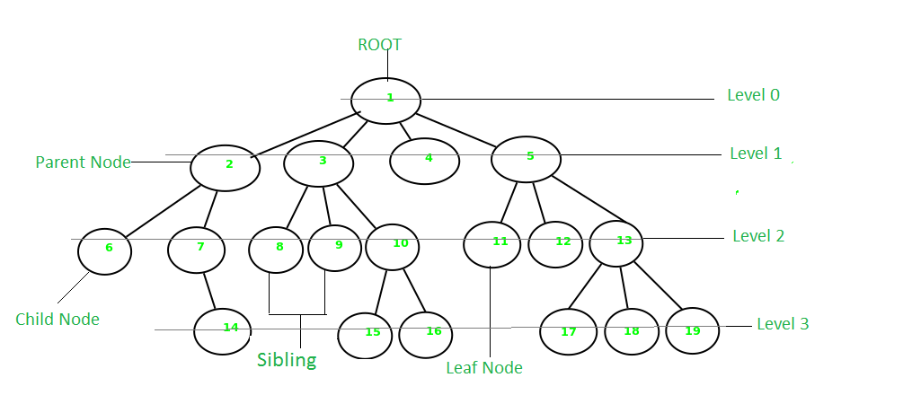
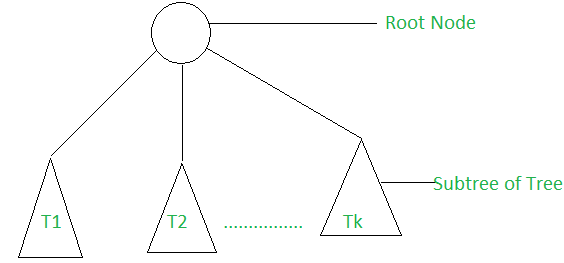

# Implementation: Trees

A tree is non-linear and a hierarchical data structure consisting of a collection of nodes such that each node of the tree stores a value, a list of references to nodes (the “children”).

 Types of Tree data structures

The different types of tree data structures are as follows:

1. General tree

A general tree data structure has no restriction on the number of nodes. It means that a parent node can have any number of child nodes.  

2. Binary tree  

A node of a binary tree can have maximum number of two child nodes. In the given tree diagram, node B, D, and F are left children, while E, C, and G are the right children.  

3. Balanced tree

If the height of the left sub-tree and the right sub-tree are equal or differs at most by 1, the tree is known as balanced tree data structure.  

4. Binary search tree

As the name implies, binary search trees are used for various searching and sorting algorithms. The examples include AVL tree and red-black tree. It is a non-linear data structure. It shows that the value of the left node is less than its parent, while the value of right node is greater than its parent.  

Properties

The following are the properties of tree data structures.  

• For the n number of nodes, the edges of a tree are equal to (n – 1). For example, 5 nodes includes (5 – 1) 4 edges in a tree data structure, as shown in the above tree diagram.  

• The arrow in the structure represents the path. Every edge connects two nodes.  

• Any two nodes or vertices of the tree graph are connected by exactly one edge.

• The depth of the node is defined as the length of the path from the root node to the node a. The height of the node ‘a’ is the longest path from the node ‘a’ to the leaf node of the given tree.  

Applications

The applications of tree data structures are as follows:

• Spanning trees

It is the shortest path tree used in the routers to direct the packets to the destination.  

• Binary Search Tree

It is a type of tree data structure that helps in maintaining a sorted stream of data.  

• Storing hierarchical data

Tree data structures are used to store the hierarchical data, which means data arranged in the form of order.  

• Syntax tree

The syntax tree represents the structure of the program’s source code, which is used in compilers.  

• Trie

It is the fast and efficient way for dynamic spell checking. It is also used for locating specific keys from within a set.  

• Heap

It is also a tree data structure that can be represented in a form of array. It is used to implement priority queues.  

===============================================================
Big O
The Big O time complexity of a Binary Search Tree’s insertion and search operations is O(h), or O(height). In the worst case, we will have to search all the way down to a leaf, which will require searching through as many nodes as the tree is tall. In a balanced (or “perfect”) tree, the height of the tree is log(n). In an unbalanced tree, the worst case height of the tree is n.

The Big O space complexity of a BST search would be O(1). During a search, we are not allocating any additional space.