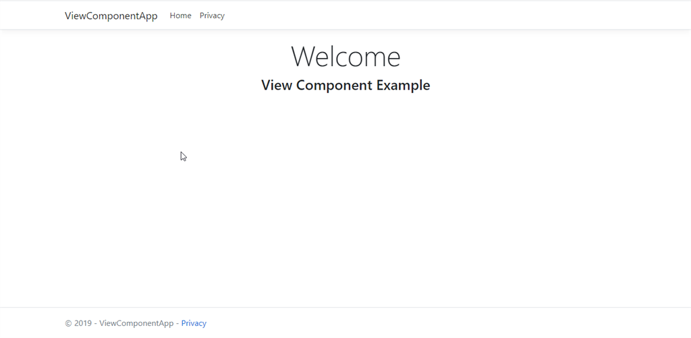
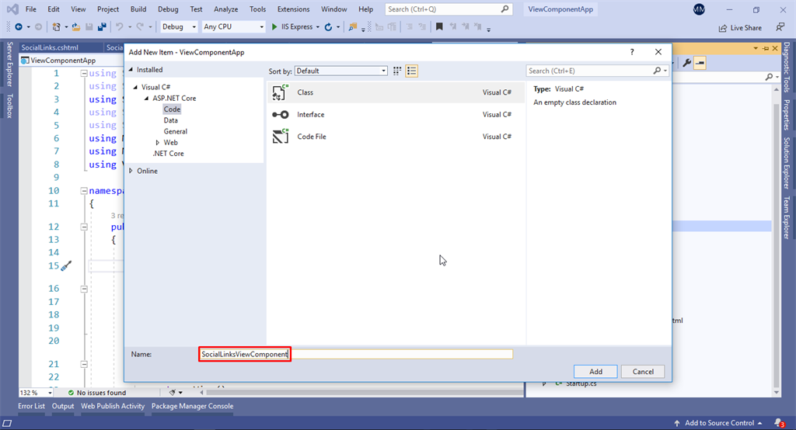
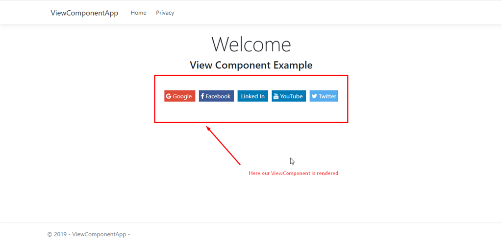

# View components in ASP.NET Core

## View components
View components are similar to partial views, but they're much more powerful. View components don't use model binding, they depend on the data passed when calling the view component. This article was written using controllers and views, but view components work with Razor Pages.

### A view component:
 - Renders a chunk rather than a whole response.
 - Includes the same separation-of-concerns and testability benefits found between a controller and view.
 - Can have parameters and business logic.
 - Is typically invoked from a layout page.
  

Step 1
 
Create a new ASP.NET Core MVC application and run that application. You can see an empty page like the following,

Step 2
 
We have to display data dynamically. In real scenarios dynamic data mostly comes from the database but for our application we do not use a database and we will create a class to generate fome data. So let's create a class. Add a class with name SocialIcon and add the following fields and methods in it, 

```C#
public class SocialIcon  
    {  
        public int ID { get; set; }  
        public string IconName { get; set; }  
        public string IconBgColor { get; set; }  
        public string IconTargetUrl { get; set; }  
        public string IconClass { get; set; }  
  
        public static List<SocialIcon> AppSocialIcons()  
        {  
            List<SocialIcon> icons = new List<SocialIcon>();  
            icons.Add(new SocialIcon { ID = 1, IconName = "Google", IconBgColor = "#dd4b39",IconTargetUrl="www.google.com", IconClass="fa fa-google" });  
            icons.Add(new SocialIcon { ID = 2, IconName = "Facebook", IconBgColor = "#3B5998", IconTargetUrl="www.facebook.com", IconClass="fa fa-facebook" });  
            icons.Add(new SocialIcon { ID = 3, IconName = "Linked In", IconBgColor = "#007bb5", IconTargetUrl = "www.linkedin.com", IconClass= "fa fa-fa-linkedin" });  
            icons.Add(new SocialIcon { ID = 4, IconName = "YouTube", IconBgColor = "#007bb5", IconTargetUrl = "www.youtube.com", IconClass="fa fa-youtube" });  
            icons.Add(new SocialIcon { ID = 5, IconName = "Twitter", IconBgColor = "#55acee", IconTargetUrl = "www.twitter.com",IconClass="fa fa-twitter" });  
  
            return icons;  
        }  
    }  
```

Step 3
 
Add a ViewComponent class with name SocialLinksViewComponent. (Don't forget to add ViewComponent with name, in our application we will use it with name SocialLinks and by writing ViewComponent with its name system will understand that it is ViewComponent and will be handled accordingly).


Step 4
ViewComponents are generated from a C# class derived from a base class ViewComponent and are typically associated with a Razor files to generate markup. Just like controllers, ViewComponents also support constructor injection. To implement SocialLinksViewComponent add the following code in your class that you have just created:

```C#
public class SocialLinksViewComponent : ViewComponent  
   {  
       List<SocialIcon> socialIcons = new List<SocialIcon>();  
       public SocialLinksViewComponent()  
       {  
           socialIcons = SocialIcon.AppSocialIcons();  
       }  
  
       public async Task<IViewComponentResult> InvokeAsync()  
       {  
           var model = socialIcons;  
           return await Task.FromResult((IViewComponentResult)View("SocialLinks", model));  
       }  
  
   }  
```
Step 5
We added a folder in Views > Shared with the name Components (it should have Components name). And will added a folder SocialLinks in this folder we created a Razor View with name SocialLinks.cshtml. Do the same and add the following code in Razor View, 
@model IList<ViewComponentApp.Models.SocialIcon>    
   ```c# 
<div class="col-md-12" style="padding-top:50px;">    
    @foreach (var icon in Model)    
    {    
        <a style="background:@icon.IconBgColor" href="@icon.IconTargetUrl">    
            <i class="@icon.IconClass"></i>    
            @icon.IconName    
        </a>    
    }    
</div>   
```
Step 6
Now we have implemented our ViewComponent and added markup html in our coresponding Razor View. Now we will call this ViewComponent in our desired page where it is needed. I am calling it on Index.cshtml page you can use it anywhere in the application with just this following code, 
```C# 
@(await Component.InvokeAsync("SocialLinks")) 
```
This above code snippet is the way we can call a ViewComponent in our Razor Views. It will render the desired markup. You can also pass parameters in ViewComponents as following,
@(await Component.InvokeAsync("SocialLinks", new { IconsToShow = 5 }))  
This is how we can pass parameters. But in our application we are not passing any parameters so we will use the snippet above. So code in our Index.cshtml page will look like this,
```C#
@{    
    ViewData["Title"] = "Home Page";    
}    
<style>    
    a {    
        padding: 5px;    
        margin: 5px;    
        color: white;    
    }    
    
    .main-div {    
        margin-bottom: 20px;    
        padding-bottom: 20px;    
    }    
</style>    
    
<div class="text-center main-div">    
    <h1 class="display-4">Welcome</h1>    
    <h3>View Component Example</h3>    
    
    @(await Component.InvokeAsync("SocialLinks", new { IconsToShow = 5 }))    
    
</div>  
```

Step 7
 
Run the application. After successfully running the application you will see the following output,



## Summary
ASP.NET MVC 6 introduces view components, a component-oriented mixture of child actions and partial views. They can return various content, including Razor views, JSON, or plain text. View components can be rendered synchronously or asynchronously. Finally, they can integrate with the dependency injection system of ASP.NET Core through constructor injection.